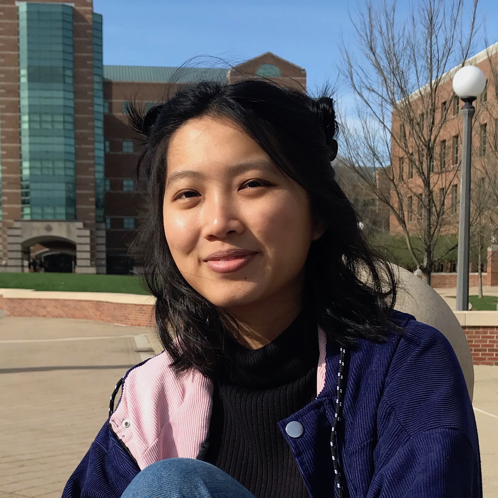

<!-- <h1 class="owner-name">{{ site.owner.name}} </h1>

{{site.about}} -->

I'm a second year M.S. student in computer science at [UIUC](https://cs.illinois.edu/). My research focuses on interpreting patterns of somatic mutations in tumors, in order to better understand cancer evolution spatially and temporally. 

Outside of research, I am passionate about open-source and promoting inclusivity in STEM. I enjoy painting, hiking, and [eating ice cream](https://www.instagram.com/kiky.cones/). 

<!-- 
 Prior to grad school, I interned at Salesforce as a Software Engineer, developing smart tools for the [Service Cloud Einstein](https://www.salesforce.com/blog/2018/07/service-cloud-einstein-bots-customer-experience.hmtl) team. I graduated from Arizona State University in 2018, where I researched in [The Haynes Lab](https://khayneslab.wordpress.com/) and the [Computing Systems & Informatics (CSI) Lab](https://sites.google.com/a/asu.edu/csi/).  -->

<i class="fa fa-book"></i> Recent Favorite: [Murder on the Orient Express](https://www.goodreads.com/review/list/11107091?shelf=currently-reading) by Agatha Christie

## Updates 
* April '20: Our [paper](https://doi.org/10.1093/bioinformatics/btaa471) on visualizing the spatial clonal architecture in tumors was accepted to ISMB 2020. 
* May '19: I joined Facebook as a software engineering intern on their Pages Ranking team.
* Aug '18: I began my graduate studies at the University of Illinois, advised by Prof. [Mohammed El-Kebir](http://www.el-kebir.net/).
* Aug '18: Our paper on diverse homoserine lactone systems for cellular communication is available in [PLoS One](https://journals.plos.org/plosone/article?id=10.1371/journal.pone.0202294).
* May '18: I [graduated](https://fullcircle.asu.edu/fulton-schools/meet-the-fulton-schools-outstanding-graduates-of-spring-2018/#et_pb_row_13) from ASU! 
* Feb '18: Our work on [Study Genie](https://dl.acm.org/citation.cfm?id=3162340), an intelligent web-based study platform, was accepted in ACM SIGCSE's student research competition.  
* Nov '16: ASU team won gold medal, 2 awards, and 2 nominations at [international synthetic biology competition](https://asunow.asu.edu/20161206-asu-puts-impressive-performance-igem).

 