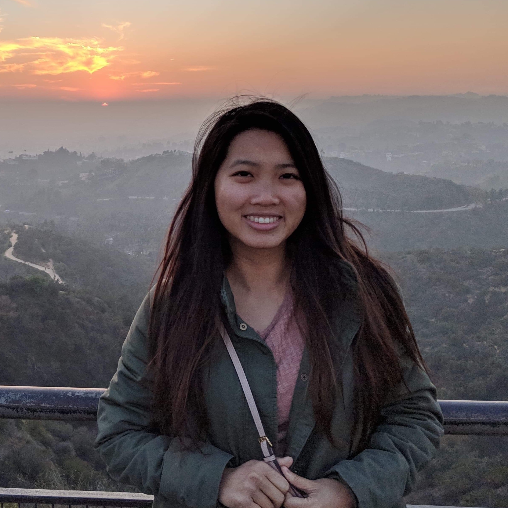

<!-- <h1 class="owner-name">{{ site.owner.name}} </h1>

{{site.about}} -->

I'm a first year M.S. student at [UIUC](https://cs.illinois.edu/) with research interests in computational biology, synthetic biology, and data mining. Passionate about open-source and promoting STEM. In my free time, I enjoy painting, reading, hiking, and [eating ice cream](https://www.instagram.com/kiky.cones/). 

<!-- Prior to grad school, I interned at Salesforce as a Software Engineer, developing smart tools for the [Service Cloud Einstein](https://www.salesforce.com/blog/2018/07/service-cloud-einstein-bots-customer-experience.hmtl) team. I graduated from Arizona State University in 2018, where I researched in [The Haynes Lab](https://khayneslab.wordpress.com/) and the [Computing Systems & Informatics (CSI) Lab](https://sites.google.com/a/asu.edu/csi/).  -->

<!-- <i class="fa fa-book fa-1x right-padding" aria-hidden="true"></i>
 -->
Recent Favorite: [Bad Blood](https://www.goodreads.com/review/list/11107091?shelf=currently-reading) by John Carreyrou

## News 
* May '19: I will be joining Facebook as a software engineering intern on their Pages Ranking team in Seattle!
* Aug '18: I began my graduate studies at the University of Illinois, working with Dr. [El-Kebir](http://www.el-kebir.net/) to visualize tumor structures. 
* Aug '18: Our paper on diverse homoserine lactone systems for cellular communication is available in [PLoS One](https://journals.plos.org/plosone/article?id=10.1371/journal.pone.0202294)! 
Diverse Homoserine Lactone Synthases 
* May '18: I [graduated](https://fullcircle.asu.edu/fulton-schools/meet-the-fulton-schools-outstanding-graduates-of-spring-2018/#et_pb_row_13) from ASU! 
* Feb '18: Our work on [Study Genie](https://dl.acm.org/citation.cfm?id=3162340), an intelligent web-based study platform, was accepted in ACM SIGCSE's student research competition.  
* Nov '16: ASU team won gold medal, 2 awards, and 2 nominations at [international synthetic biology competition](https://asunow.asu.edu/20161206-asu-puts-impressive-performance-igem).

 

  
    <a href="{{ site.owner.linkedin }}" class="social-media-icons"><i class="fa fa-2x fa-linkedin-square" aria-hidden="true"></i></a>
  
  
    <a href="mailto:{{ site.owner.email }}" class="social-media-icons"><i class="fa fa-2x fa-envelope-square" aria-hidden="true"></i></a>
  
  
    <a href="{{ site.owner.twitter }}" class="social-media-icons"><i class="fa fa-2x fa-twitter-square" aria-hidden="true"></i></a>
  
  
    <a href="{{ site.owner.github }}" class="social-media-icons"><i class="fa fa-2x fa-github-square" aria-hidden="true"></i></a>
  

